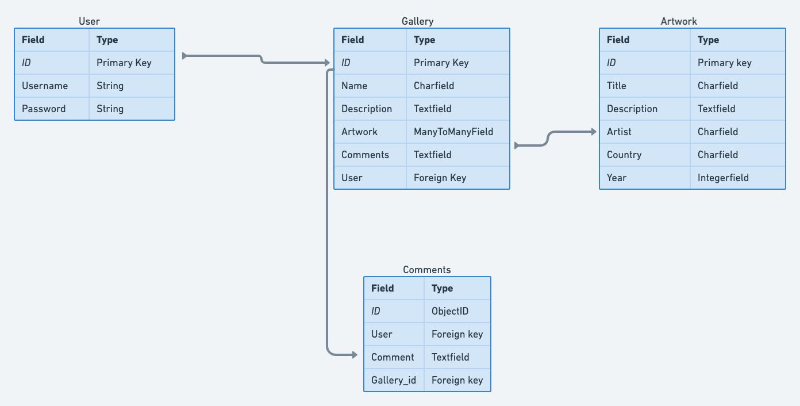
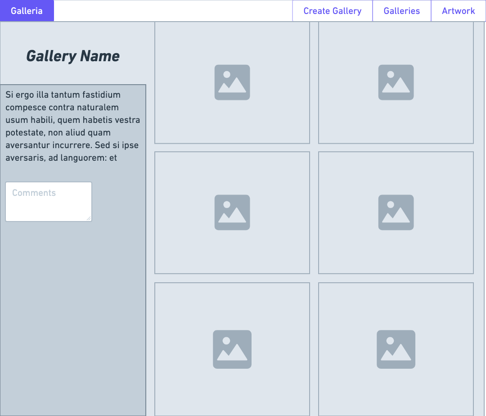
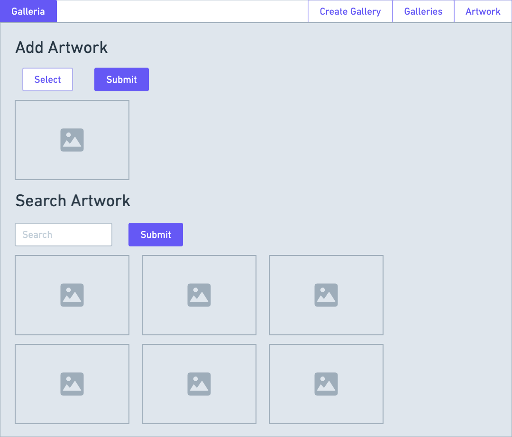
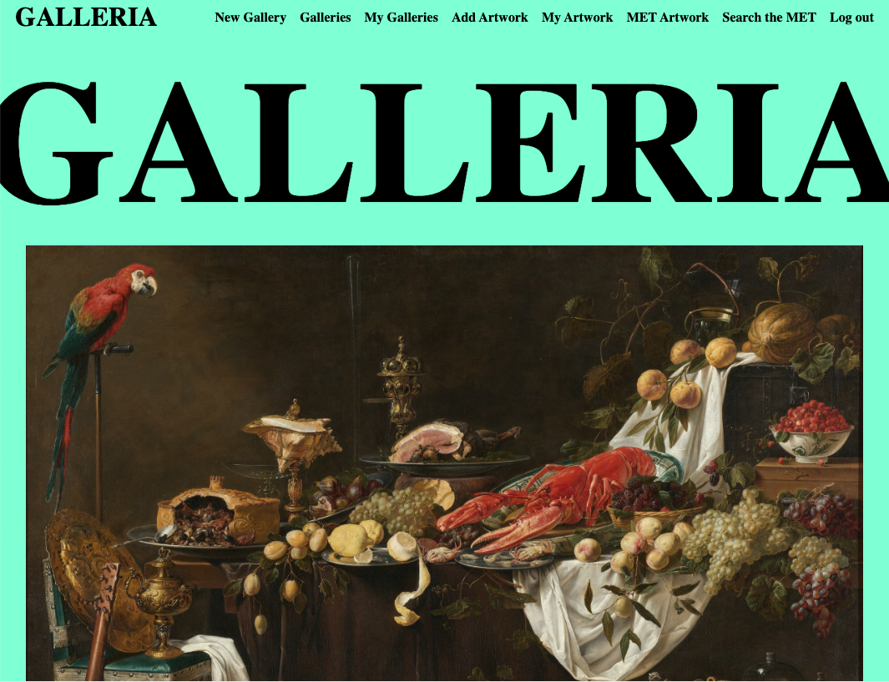
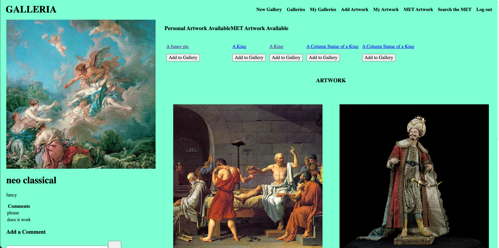

# GALLERIA

Galleria is a artwork gallery viewing website where you can create galleries and add artwork from the MET Museum or from your own computer.

Visit the site [here](https://xplor-usa.herokuapp.com/).

## Motivation: 
Im very passionate about art and wanted to create something that allows people to view different kinds of art curated based on a gallery type.
***
## Site:
***
Here are my planning materials [trello](https://trello.com/b/EELPUGRN/galleria)! 

ERD:

 

Landing page wire-frame:

Gallery details wire-frame:

Artwork search wire-frame:

Landing Page :

Gallery :

## Technology Implemented:

### HTML

### CSS

### Python

### Django

## Stretch Goals:
-Improve the UI the site

## Credits:

### API - [MET Museum API](https://metmuseum.github.io/#search)
